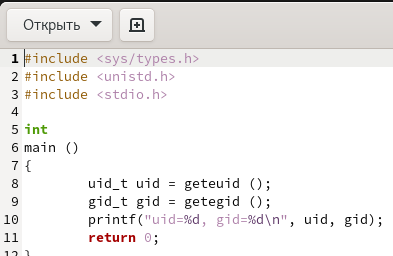
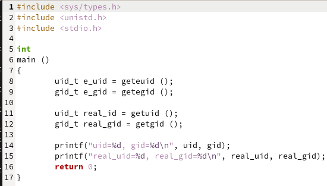
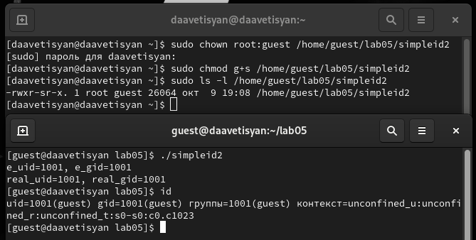
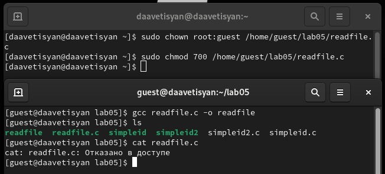
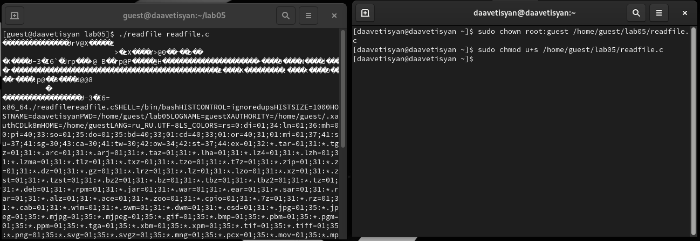
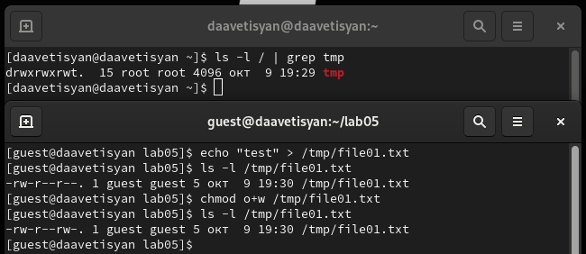
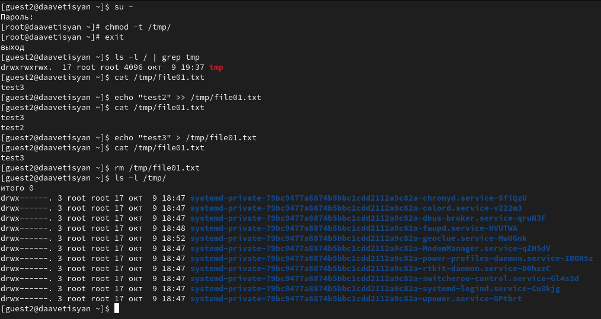
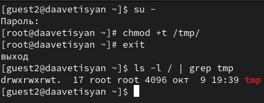

---
# Front matter
lang: ru-RU
title: "Лабораторная работа №5"
subtitle: "Дисциплина: Основы информационной безопасности"
author: "Аветисян Давид Артурович"

# Formatting
toc-title: "Содержание"
toc: true # Table of contents
toc_depth: 2
lof: true # Список рисунков
lot: true # Список таблиц
fontsize: 12pt
linestretch: 1.5
papersize: a4paper
documentclass: scrreprt
polyglossia-lang: russian
polyglossia-otherlangs: english
mainfont: PT Serif
romanfont: PT Serif
sansfont: PT Sans
monofont: PT Mono
mainfontoptions: Ligatures=TeX
romanfontoptions: Ligatures=TeX
sansfontoptions: Ligatures=TeX,Scale=MatchLowercase
monofontoptions: Scale=MatchLowercase
indent: true
pdf-engine: lualatex
header-includes:
  - \linepenalty=10 # the penalty added to the badness of each line within a paragraph (no associated penalty node) Increasing the value makes tex try to have fewer lines in the paragraph.
  - \interlinepenalty=0 # value of the penalty (node) added after each line of a paragraph.
  - \hyphenpenalty=50 # the penalty for line breaking at an automatically inserted hyphen
  - \exhyphenpenalty=50 # the penalty for line breaking at an explicit hyphen
  - \binoppenalty=700 # the penalty for breaking a line at a binary operator
  - \relpenalty=500 # the penalty for breaking a line at a relation
  - \clubpenalty=150 # extra penalty for breaking after first line of a paragraph
  - \widowpenalty=150 # extra penalty for breaking before last line of a paragraph
  - \displaywidowpenalty=50 # extra penalty for breaking before last line before a display math
  - \brokenpenalty=100 # extra penalty for page breaking after a hyphenated line
  - \predisplaypenalty=10000 # penalty for breaking before a display
  - \postdisplaypenalty=0 # penalty for breaking after a display
  - \floatingpenalty = 20000 # penalty for splitting an insertion (can only be split footnote in standard LaTeX)
  - \raggedbottom # or \flushbottom
  - \usepackage{float} # keep figures where there are in the text
  - \floatplacement{figure}{H} # keep figures where there are in the text
---

# Цель работы

Изучение механизмов изменения идентификаторов, применения SetUID- и Sticky-битов. Получение практических навыков работы в консоли с дополнительными атрибутами. Рассмотрение работы механизма смены идентификатора процессов пользователей, а также влияние бита Sticky на запись и удаление файлов.

# Теоретическое введение

SetUID, SetGID и Sticky - это специальные типы разрешений позволяют задавать расширенные права доступа на файлы или каталоги. 
• SetUID (set user ID upon execution — «установка ID пользователя во время выполнения) являются флагами прав доступа в Unix, которые разрешают пользователям запускать исполняемые файлы с правами владельца исполняемого файла.
• SetGID (set group ID upon execution — «установка ID группы во время выполнения») являются флагами прав доступа в Unix, которые разрешают пользователям запускать исполняемые файлы с правами группы исполняемого файла.
• Sticky bit в основном используется в общих каталогах, таких как /var или /tmp, поскольку пользователи могут создавать файлы, читать и выполнять их, принадлежащие другим пользователям, но не могут удалять файлы, принадлежащие другим пользователям.
Более подробно см. в [1].

# Выполнение лабораторной работы

1 часть: Создание программы

1) Для начала мы убеждаемся, что компилятор gcc установлен, исолпьзуя команду “gcc -v”. Затем отключаем систему запретов до очередной перезагрузки системы командой “sudo setenforce 0”, после чего команда “getenforce” выводит “Permissive” (@fig:001).

{ #fig:001 }

2) Проверяем успешное выполнение команд “whereis gcc” и “whereis g++” (их расположение)( @fig:002).

{ #fig:002 }

3) Входим в систему от имени пользователя guest командой “su - guest”. Создаём программу simpleid.c командой “touch simpleid.c” и открываем её в редакторе командой “gedit /home/guest/lab05/simpleid.c” (@fig:003).

{ #fig:003 }

4) Код программы выглядит следующим образом (@fig:004).

{ #fig:004 }

5) Скомпилируем программу и убедимся, что файл программы был создан командой “gcc simpleid.c -o simpleid”. Выполняем программу simpleid командой “./simpleid”, а затем системную программу id командой “id”. Результаты, полученные в результате выполнения обеих команд, совпадают(uid=1001 и gid=1001) (@fig:005).

{ #fig:005 }

6) Усложняем программу, добавив вывод действительных идентификаторов, новый файл назовём simpleid.c (@fig:006).

{ #fig:006 }

7) Скомпилируем и запустим simpleid2.c командами “gcc simpleid2.c -o simpleid2” и “./simpleid2” (@fig:007).

{ #fig:007 }

8) От имени суперпользователя выполняем команды “sudo chown root:guest /home/guest/lab05/simpleid2” и “sudo chmod u+s /home/guest/lab05/simpleid2”, затем выполняем проверку правильности установки новых атрибутов и смены владельца файла simpleid2 командой “sudo ls -l /home/guest/lab05/simpleid2” (@fig:008). Этими командами была произведена смена пользователя файла на root и установлен SetUID-бит.

{ #fig:008 }

9) Запускаем программы simpleid2 и id. Теперь появились различия в uid (@fig:009).

{ #fig:009 }

10) Проделаем тоже самое относительно SetGID-бита. Также можем заметить различия с предыдущим пунктом (@fig:010).

{ #fig:010 }

11) Создаем программу readfile.c (@fig:011).

{ #fig:011 }

12) Скомпилируем созданную программу командой “gcc readfile.c -o readfile”. Сменим владельца у файла readfile.c командой “sudo chown root:guest /home/guest/readfile.c” и поменяем права так, чтобы только суперпользователь мог прочитать его, а guest не мог, с помощью команды “sudo chmod 700 /home/guest/readfile.c”. Убеждаемся, что пользователь guest не может прочитать файл readfile.c командой “cat readfile.c”, получив отказ в доступе (@fig:012).

{ #fig:012 }

13)П оменяем владельца у программы readfile и установим SetUID. Проверим, может ли программа readfile прочитать файл readfile.c командой “./readfile readfile.c”. Прочитать удалось. Аналогично проверяем, можно ли прочитать файл /etc/shadow. Прочитать удалось (@fig:013).

{ #fig:013 }

2 часть: Исследование Sticky-бита

1) Командой “ls -l / | grep tmp” убеждаемся, что атрибут Sticky на директории /tmp установлен. От имени пользователя guest создаём файл file01.txt в директории /tmp со словом test командой “echo”test” > /tmp/file01.txt”. Просматриваем атрибуты у только что созданного файла и разрешаем чтение и запись для категории пользователей “все остальные” командами “ls -l /tmp/file01.txt” и “chmod o+rw /tmp/file01.txt” (@fig:014).

{ #fig:014 }

2) От имени пользователя guest2 пробуем прочитать файл командой “cat /tmp/file01.txt” - это удалось. Далее пытаемся дозаписать в файл слово test2, проверить содержимое файла и записать в файл слово test3, стерев при этом всю имеющуюся в файле информацию - эти операции удалось выполнить только в случае, если еще дополнительно разрешить чтение и запись для группы пользователей командой “chmod g+rw /tmp/file01.txt”. От имени пользователя guest2 пробуем удалить файл - это не удается ни в каком из случаев, возникает ошибка (@fig:015).

{ #fig:015 }

3) Повышаем права до суперпользователя командой “su -” и выполняем команду, снимающую атрибут t с директории /tmp “chmod -t /tmp”. После чего покидаем режим суперпользователя командой “exit”. Повторяем предыдущие шаги. Теперь нам удаётся удалить файл file01.txt от имени пользователя, не являющегося его владельцем (@fig:016).

{ #fig:016 }

4) Повышаем свои права до суперпользователя и возвращаем атрибут t на директорию /tmp (@fig:017).

{ #fig:017 }

# Выводы

- В ходе выполнения данной лабораторной работы я изучил механизмы изменения идентификаторов, применение SetUID- и Sticky-битов. Получил практические навыки работы в консоли с дополнительными атрибутами. Рассмотрел работу механизма смены идентификатора процессов пользователей, а также влияние бита Sticky на запись и удаление файлов.

# Список литературы

- Стандартные права SetUID, SetGID, Sticky в Linux [Электронный ресурс]. URL: https://linux-notes.org/standartny-e-prava-unix-suid-sgid-sticky-bity/.

