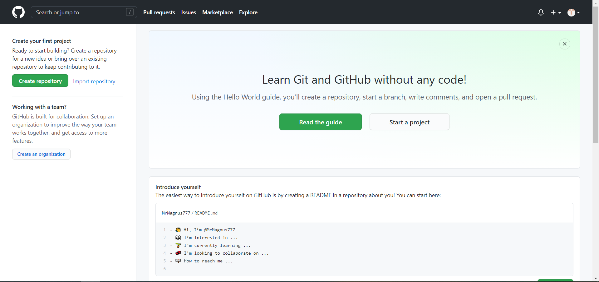
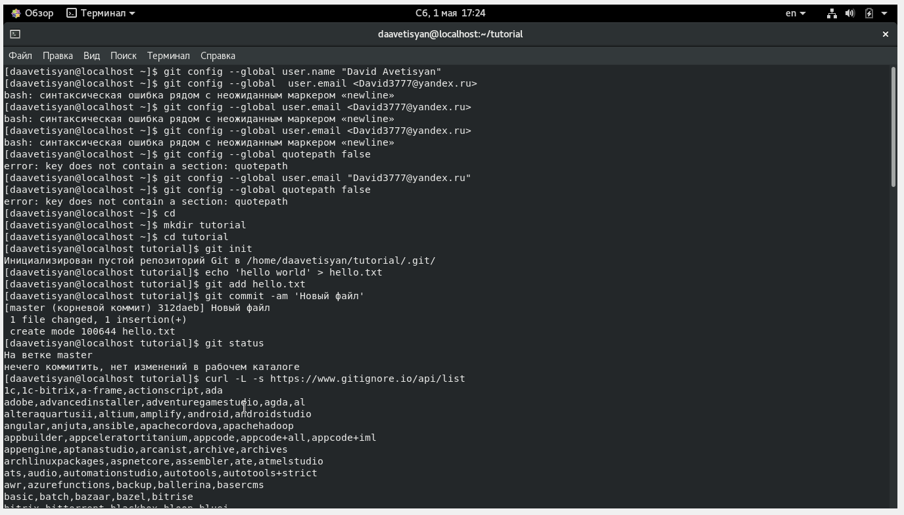
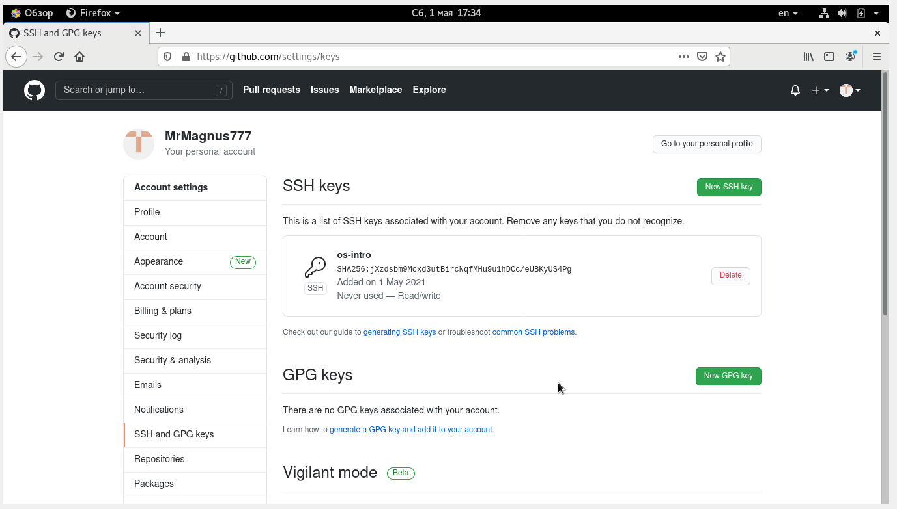
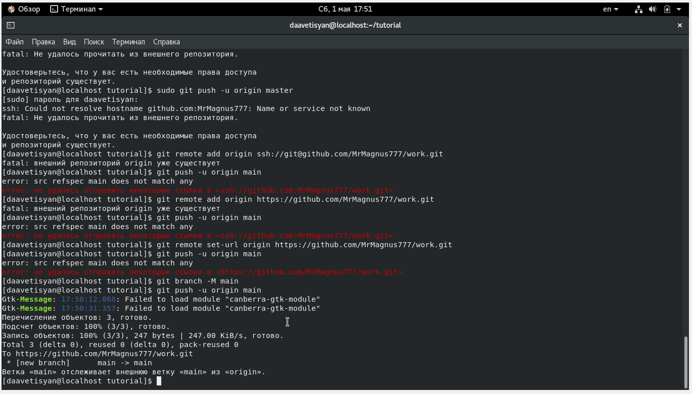
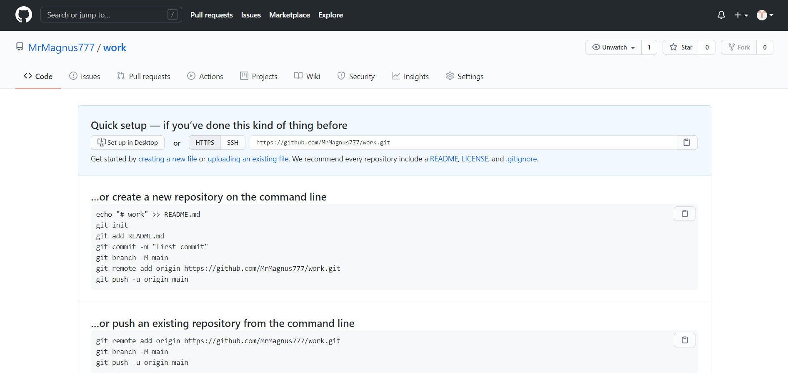
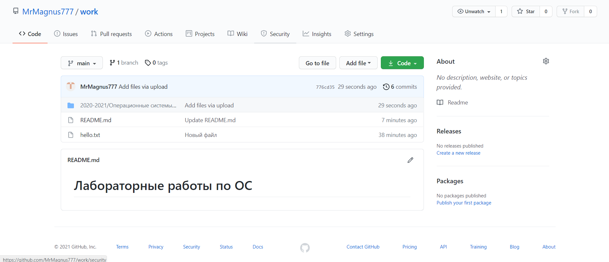
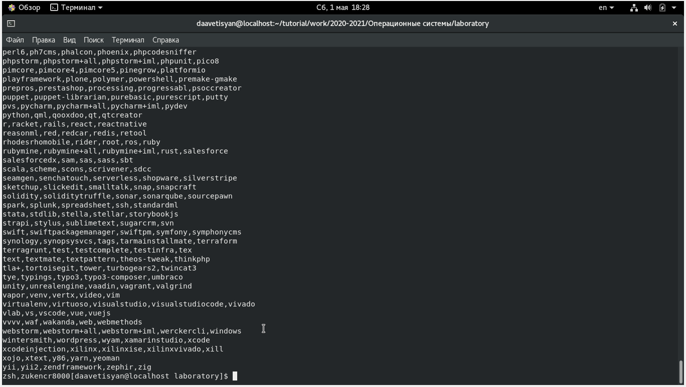
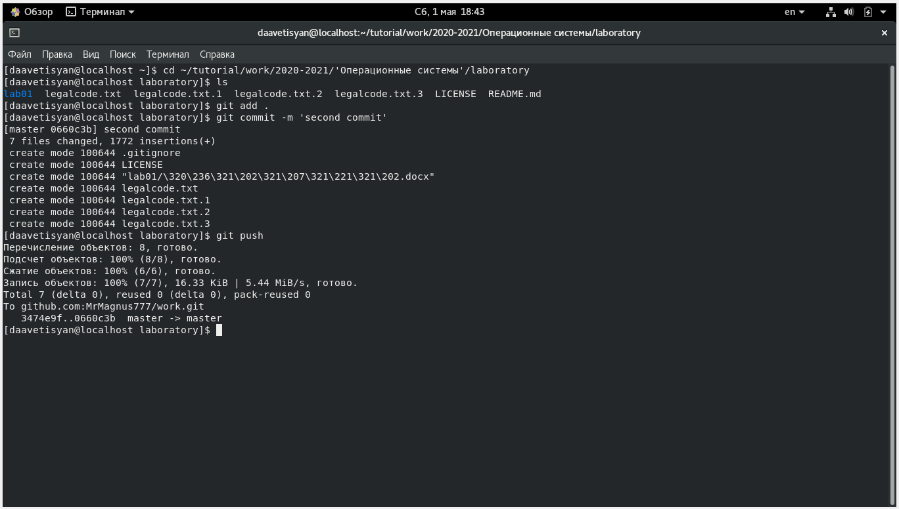

---
# Front matter
lang: ru-RU
title: "Отчёт по лабораторной работе №3"
subtitle: "Дисциплина: Операционные системы"
author: "Аветисян Давид Артурович"

# Formatting
toc-title: "Содержание"
toc: true # Table of contents
toc_depth: 2
lof: true # List of figures
lot: true # List of tables
fontsize: 12pt
linestretch: 1.5
papersize: a4paper
documentclass: scrreprt
polyglossia-lang: russian
polyglossia-otherlangs: english
mainfont: PT Serif
romanfont: PT Serif
sansfont: PT Sans
monofont: PT Mono
mainfontoptions: Ligatures=TeX
romanfontoptions: Ligatures=TeX
sansfontoptions: Ligatures=TeX,Scale=MatchLowercase
monofontoptions: Scale=MatchLowercase
indent: true
pdf-engine: lualatex
header-includes:
  - \linepenalty=10 # the penalty added to the badness of each line within a paragraph (no associated penalty node) Increasing the value makes tex try to have fewer lines in the paragraph.
  - \interlinepenalty=0 # value of the penalty (node) added after each line of a paragraph.
  - \hyphenpenalty=50 # the penalty for line breaking at an automatically inserted hyphen
  - \exhyphenpenalty=50 # the penalty for line breaking at an explicit hyphen
  - \binoppenalty=700 # the penalty for breaking a line at a binary operator
  - \relpenalty=500 # the penalty for breaking a line at a relation
  - \clubpenalty=150 # extra penalty for breaking after first line of a paragraph
  - \widowpenalty=150 # extra penalty for breaking before last line of a paragraph
  - \displaywidowpenalty=50 # extra penalty for breaking before last line before a display math
  - \brokenpenalty=100 # extra penalty for page breaking after a hyphenated line
  - \predisplaypenalty=10000 # penalty for breaking before a display
  - \postdisplaypenalty=0 # penalty for breaking after a display
  - \floatingpenalty = 20000 # penalty for splitting an insertion (can only be split footnote in standard LaTeX)
  - \raggedbottom # or \flushbottom
  - \usepackage{float} # keep figures where there are in the text
  - \floatplacement{figure}{H} # keep figures where there are in the text
---

# Цель работы

Целью данной работы является изучение идеологии и применение средств контроля версий.

# Задание

Сделайте отчёт по предыдущей лабораторной работе в формате Markdown. В качестве отчёта просьба предоставить отчёты в 3 форматах:pdf,docx и md (в архиве,поскольку он должен содержать скриншоты, Makefile и т.д.)

# Выполнение лабораторной работы

Создаем учётную запись на https://github.com (рис. -@fig:001).

{ #fig:001 }

1) Настраиваем систему контроля версий git.
- Синхронизируем учётную запись github с компьютером (рис. -@fig:002):
- git config --global user.name "David Avetisyan"
- git config --global user.email “David3777@yandex.ru"
- Затем создаём новый ключ на github ssh-keygen -C "David Avetisyan<David3777@yandex.ru>") (рис. -@fig:003, рис. -@fig:004) и привязываем его к компьютеру через консоль (рис. -@fig:005).

{ #fig:002 }

{ #fig:003 }

{ #fig:004 }

{ #fig:005 }

2) Созданием и подключаем репозиторий к github.
- На сайте заходим в «repository» и создаём новый репозиторий под названием work. Переносим его на наш компьютер (рис. -@fig:006).

{ #fig:006 }

Создаем рабочий каталог (рис. -@fig:007).

{ #fig:007 }

Добавляем первый commit и выкладываем на github. Для того, чтобы правильно разместить первый коммит, необходимо добавить команду git add ., после этого с помощью команды git commit -m "first commit" выкладываем коммит. Сохраняем первый коммит, используя команду git push (рис. -@fig:008).

{ #fig:008 }

3) Первичная конфигурация.
- Добавляем файл лицензии. Добавляем шаблон игнорируемых файлов. Просматриваем список имеющихся шаблонов (рис. -@fig:009). Скачиваем шаблон (например, для C) и выполняем коммит. Отправляем на github (команда git push) (рис. -@fig:010).

{ #fig:009 }

{ #fig:010 }

4) Работаем с конфигурацией git-flow.
- У нас не получилось установить git-flow, так как root этого не допустил. В связи с этим дальнейшие действия выполнить невозможно.

# Выводы

Я изучил идеологию и применение контроля версий.
