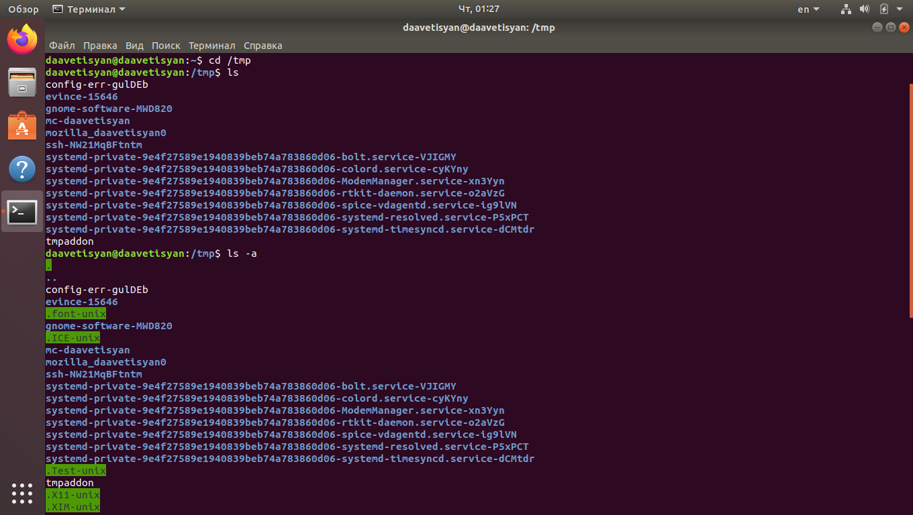
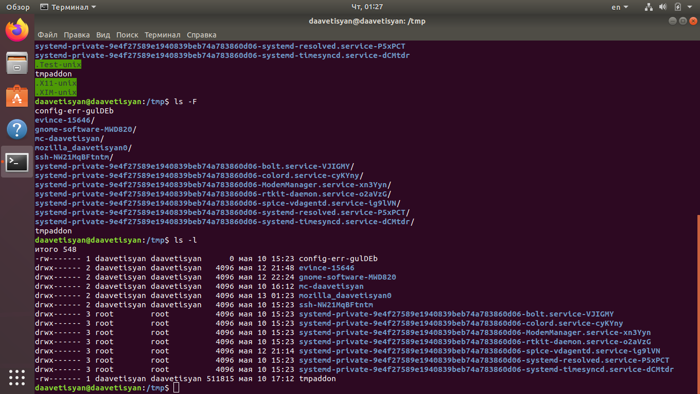
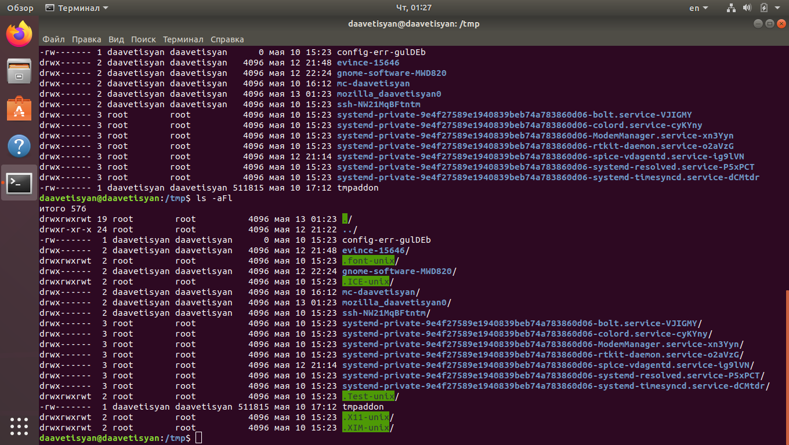
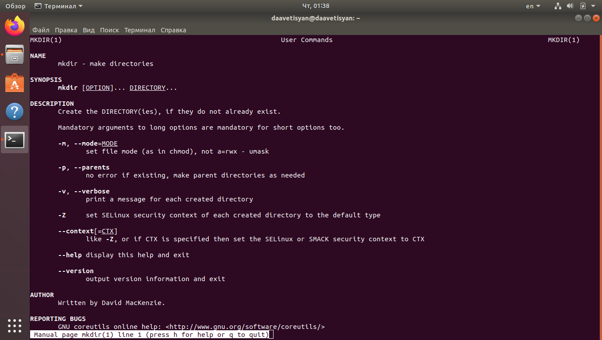
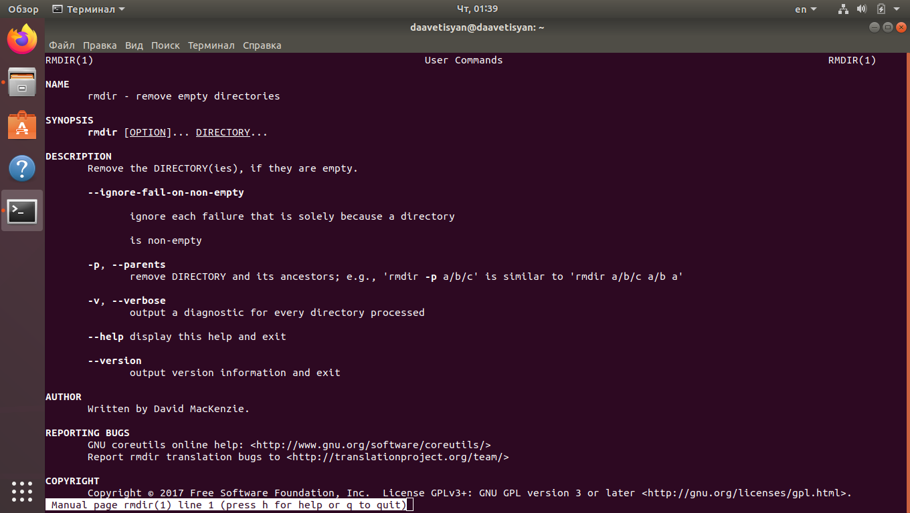
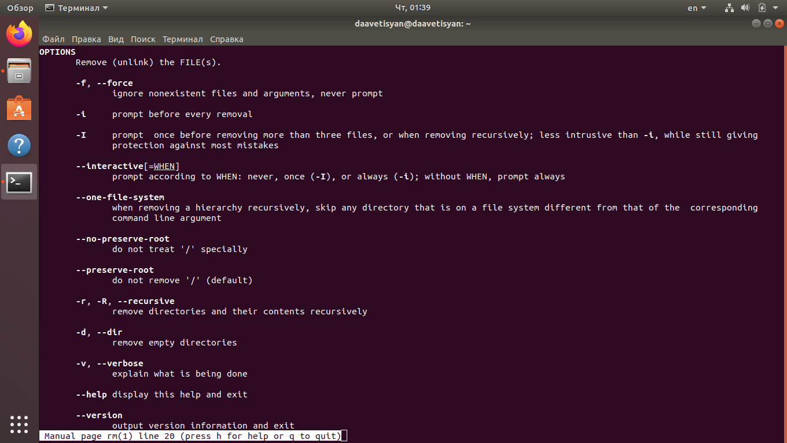
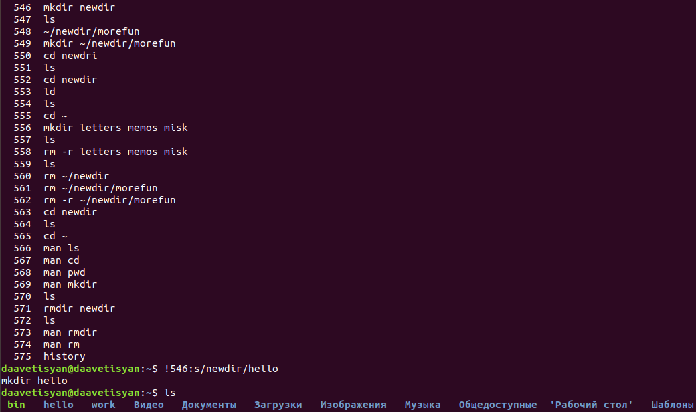

---
# Front matter
lang: ru-RU
title: "Отчёт по лабораторной работе №5"
subtitle: "Дисциплина: Операционные системы"
author: "Аветисян Давид Артурович"

# Formatting
toc-title: "Содержание"
toc: true # Table of contents
toc_depth: 2
lof: true # List of figures
lot: true # List of tables
fontsize: 12pt
linestretch: 1.5
papersize: a4paper
documentclass: scrreprt
polyglossia-lang: russian
polyglossia-otherlangs: english
mainfont: PT Serif
romanfont: PT Serif
sansfont: PT Sans
monofont: PT Mono
mainfontoptions: Ligatures=TeX
romanfontoptions: Ligatures=TeX
sansfontoptions: Ligatures=TeX,Scale=MatchLowercase
monofontoptions: Scale=MatchLowercase
indent: true
pdf-engine: lualatex
header-includes:
  - \linepenalty=10 # the penalty added to the badness of each line within a paragraph (no associated penalty node) Increasing the value makes tex try to have fewer lines in the paragraph.
  - \interlinepenalty=0 # value of the penalty (node) added after each line of a paragraph.
  - \hyphenpenalty=50 # the penalty for line breaking at an automatically inserted hyphen
  - \exhyphenpenalty=50 # the penalty for line breaking at an explicit hyphen
  - \binoppenalty=700 # the penalty for breaking a line at a binary operator
  - \relpenalty=500 # the penalty for breaking a line at a relation
  - \clubpenalty=150 # extra penalty for breaking after first line of a paragraph
  - \widowpenalty=150 # extra penalty for breaking before last line of a paragraph
  - \displaywidowpenalty=50 # extra penalty for breaking before last line before a display math
  - \brokenpenalty=100 # extra penalty for page breaking after a hyphenated line
  - \predisplaypenalty=10000 # penalty for breaking before a display
  - \postdisplaypenalty=0 # penalty for breaking after a display
  - \floatingpenalty = 20000 # penalty for splitting an insertion (can only be split footnote in standard LaTeX)
  - \raggedbottom # or \flushbottom
  - \usepackage{float} # keep figures where there are in the text
  - \floatplacement{figure}{H} # keep figures where there are in the text
---

# Цель работы

Приобретение практических навыков взаимодействия пользователя с системой посредством командной строки.

# Задание

1. Определите полное имя вашего домашнего каталога. Далее относительно этого каталога будут выполняться последующие упражнения.
2. Выполните следующие действия:
  1. Перейдите в каталог /tmp.
  2. Выведите на экран содержимое каталога /tmp. Для этого используйте команду ls с различными опциями. Поясните разницу в выводимой на экран информации.
  3. Определите, есть ли в каталоге /var/spool подкаталог с именем cron?
  4. Перейдите в Ваш домашний каталог и выведите на экран его содержимое. Определите, кто является владельцем файлов и подкаталогов?
3. Выполните следующие действия:
  1. В домашнем каталоге создайте новый каталог с именем newdir.
  2. В каталоге ~/newdir создайте новый каталог с именем morefun.
  3. В домашнем каталоге создайте одной командой три новых каталога с именами letters, memos, misk. Затем удалите эти каталоги одной командой.
  4. Попробуйте удалить ранее созданный каталог ~/newdir командой rm. Проверьте, был ли каталог удалён.
  5. Удалите каталог ~/newdir/morefun из домашнего каталога. Проверьте, был ли каталог удалён.
4. С помощью команды man определите, какую опцию команды ls нужно использовать для просмотра содержимое не только указанного каталога, но и подкаталогов, входящих в него.
5. С помощью команды man определите набор опций команды ls , позволяющий отсортировать по времени последнего изменения выводимый список содержимого каталога с развёрнутым описанием файлов.
6. Используйте команду man для просмотра описания следующих команд: cd, pwd, mkdir, rmdir, rm. Поясните основные опции этих команд.
7. Используя информацию, полученную при помощи команды history, выполните модификацию и исполнение нескольких команд из буфера команд.

# Выполнение лабораторной работы

1. Определяем полное имя домашнего каталога, используя команду «pwd» (рис. -@fig:001), т.к. уже находимся в домашнем каталоге (обозначается: ~). Если бы мы не находились в нем, необходимо было бы предварительно использовать команду «cd ~», чтобы перейти в него.

{ #fig:001 }

2. 
   1. Переходим в каталог /tmp, используя команду «cd /tmp» (рис. -@fig:002).
   2. Выводим на экран содержимое каталога /tmp, используя команду «ls» с различными опциями (рис. -@fig:003) (рис. -@fig:004):  
   «ls» − выводится список каталогов и файлов, которые можно увидеть,«вручную» открыв каталог tmp  
   «ls -a» − к списку, описанному в предыдущем пункте, добавляются скрытые каталоги и файлы (их имена начинаются с точки)  
   «ls -F» − с помощью этой команды получаем информацию о типах файлов  
   «ls -l» − получаем список каталогов и файлов, но уже с более подробной информацией о них  
   «ls -aFl» − данная команда отобразит список всех каталогов и файлов, в том числе и скрытых, с подробной информацией о них.

{ #fig:002 }

{ #fig:003 }

{ #fig:004 }

   3. Чтобы определить, есть ли в каталоге /var/spool подкаталог с именем cron, перейдем в указанный каталог с помощью команды «cd /var/spool», просмотрим его содержимое, используя команду «ls», и таким образом убедимся, что данный подкаталог существует (рис. -@fig:005).

{ #fig:005 }

   4. Далее перехожу в свой домашний каталог с помощью команды «cd ~» и, используя команду «ls -aFl», вывожу на экран его содержимое. Из (рис. -@fig:006) видно, что владельцем всех каталогов и файлов, кроме родительского каталога (его владелец пользователь root из группы пользователей root), является пользователь daavetisyan из группы пользователей daavetisyan.

{ #fig:006 }

3. 
   1. В домашнем каталоге создаем новый каталог newdir, используя команду «mkdir newdir» (рис. -@fig:007). Убеждаемся, что каталог создан, с помощью команды «ls».

{ #fig:007 }

   2. Cоздаем каталог morefun, используя команду «mkdir ~/newdir/morefun», после чего командой «cd newdir» переходим в ранее созданный каталог и там командой «ls» проверяем правильность выполненных действий (рис. -@fig:008).

{ #fig:008 }

   3. Используя команду «mkdir letters memos misk», создаем в домашнем каталоге три новых. Далее с помощью команды «rm –r letters memos misk» удаляем созданные каталоги (рис. -@fig:009). Командой «ls» проверяем правильность выполненных действий.

{ #fig:009 }

   4. Пробуем удалить каталог newdir командой «rm newdir». Получаем отказ в выполнении команды (т.к. данный каталог содержит подкаталог morefun и требуется при удалении использовать опцию -r) (рис. -@fig:010).

{ #fig:010 }

   5. Удаляем каталог newdir/morefun, используя команду «rm –r newdir/morefun». Командой «ls» проверяем правильность выполненного действия (рис. -@fig:011).

{ #fig:011 }

4. Используя команду «man ls», определяю, какую опцию команды ls необходимо использовать, чтобы просмотреть содержимое не тольк указанного каталога, но и подкаталогов, входящих в него (рис. -@fig:012).

{ #fig:012 }

5. Используя то же руководство по команде «ls», открытое в предыдущем пункте, определяю набор опций команды ls, позволяющий отсортировать по времени последнего изменения выводимый список содержимого каталога с развернутым описанием файлов (рис. -@fig:013) (рис. -@fig:014) (рис. -@fig:015).

{ #fig:013 }

{ #fig:014 }

{ #fig:015 }

6. Используя команды «man cd», «man pwd», «man mkdir», «man rmdir», «man rm», просматриваю описание соответствующих команд. Команда cd не имеет дополнительных опций.  

Команда pwd (рис. -@fig:016):  
-L, --logical - не разыменовывать символические ссылки. Если путь содержит символические ссылки, то выводить их без преобразования в исходный путь;  
-P, --physical - преобразовывать (отбрасывать символические ссылки) символические ссылки в исходные имена. Если путь содержит символические ссылки, то они будут преобразованы в названия исходных директорий, на которые они указывают;  
--help - показать справку по команде pwd;  
--version - показать версию утилиты pwd.

{ #fig:016 }

Команда mkdir (рис. -@fig:017):  
-m, --mode=MODE - устанавливает права доступа для создаваемой директории. Синтаксис MODE такой же как у команды chmod;  
-p, --parents - создать все директории, которые указаны внутри пути. Если какая-либо директория существует, то предупреждение об этом не выводится;  
-v, --verbose - выводить сообщение о каждой создаваемой директории;  
-z - установить контекст SELinux для создаваемой директории по умолчанию;  
--context=CTX - установить контекст SELinux для создаваемой директории в значение CTX;  
--help - показать справку по команде mkdir;  
--version - показать версию утилиты mkdir.

{ #fig:017 }

Команда rmdir (рис. -@fig:018):  
--ignore-fail-on-non-empty - игнорировать директории, которые содержат в себе файлы;  
-p, --parents - в этой опции каждый аргумент каталога обрабатывается как путь, из которого будут удалены все компоненты, если они уже пусты, начиная с последнего компонента;  
-v, --verbose - отображение подробной информации для каждого - обрабатываемого каталога;  
--help - показать справку по команде rmdir;  
--version - показать версию утилиты rmdir.

{ #fig:018}

Команда rm (рис. -@fig:019):  
-f, --force - игнорировать несуществующие файлы и аргументы. Никогда не выдавать запросы на подтверждение удаления;  
-i - выводить запрос на подтверждение удаления каждого файла;  
-I - выдать один запрос на подтверждение удаления всех файлов, если удаляется больше трех файлов или используется рекурсивное удаление.  
Опция применяется, как более «щадящая» версия опции –i;  
--interactive=WHEN - вместо WHEN можно использовать: never — никогда не выдавать запросы на подтверждение удаления.  
once — выводить запрос один раз (аналог опции -I).  
always — выводить запрос всегда (аналог опции -i).  
Если значение КОГДА не задано, то используется always;  
--one-file-system - во время рекурсивного удаления пропускать директории, которые находятся на других файловых системах;  
--no-preserve-root - если в качестве директории для удаления задан корневой раздел /, то считать, что это обычная директория и начать выполнять удаление;  
--preserve-root=all - если в качестве директории для удаления задан корневой раздел /, то запретить выполнять команду rm над корневым разделом. Данное поведение используется по умолчанию;  
-r, -R, --recursive - удаление директорий и их содержимого. Рекурсивное удаление;  
-d, --dir - удалять пустые директории;  
-v, --verbose - выводить информацию об удаляемых файлах;  
--help - показать справку по команде rm;  
--version - показать версию утилиты rm.

{ #fig:019}

7. Выведем историю команд с помощью команды «history» (рис. -@fig:020). Далее, используя команды, указанные на рисунках, создадим каталог hello, в нём создадим подкаталог world, попробуем удалить (неудачно) каталог hello, используя rmdir, и удалим каталог hello при помощи команды rm (рис. -@fig:021).

{ #fig:020}

{ #fig:021}

# Контрольные вопросы

1. Командная строка – специальная программа, позволяющая управлять операционной системой при помощи текстовых команд, вводимых в окне приложения.
2. Для определения абсолютного пути к текущему каталогу используется команда pwd (print working directory). Например, команда «pwd» в моем домашнем каталоге выведет: /home/daavetisyan.
3. Команда «ls -F» (или «ls -aF», тогда появятся еще скрытые файлы) выведет имена файлов в текущем каталоге и их типы. Тип каталога обозначается /, тип исполняемого файла обозначается *, тип ссылки обозначается @.
4. Имена скрытых файлов начинаются с точки. Эти файлы в операционной системе скрыты от просмотра и обычно используются для настройки рабочей среды. Для того, чтобы отобразить имена скрытых файлов, необходимо использовать команду «ls –a».
5. Команда rm используется для удаления файлов и/или каталогов. Команда rm -i выдает запрос подтверждения на удаление файла. Команда rm -r необходима, чтобы удалить каталог, содержащий файлы. Без указания этой опции команда не будет выполняться. Если каталог пуст, то можно воспользоваться командой rmdir. Если удаляемый каталог содержит файлы, то команда не будет выполнена – нужно использовать «rm -r имя_каталога». Таким образом, каталог, не содержащий файлов, можно удалить и командой rm, и командой rmdir. Файл командой rmdir удалить нельзя.
6. Чтобы определить, какие команды выполнил пользователь в сеансе работы, необходимо воспользоваться командой «history».
7. Чтобы исправить или запустить на выполнение команду, которую пользователь уже использовал в сеансе работы, необходимо: в первом случае: воспользоваться конструкцией !<номер_команды>:s/<что_меняем>/<на_что_меняем>, во втором случае: !<номер_команды>.
8. Чтобы записать в одной строке несколько команд, необходимо между ними поставить ; . Например, «cd /tmp; ls».
9. Символ обратного слэша \ позволяет использовать управляющие символы ( ".", "/", "$", "*", "[", "]", "^", "&") без их интерпретации командной оболочкой; процедура добавления данного символа перед управляющими символами называется экранированием символов. Например, команда «ls newdir\/morefun» отобразит содержимое каталога newdir/morefun.
10. Команда «ls -l» отображает список каталогов и файлов с подробной информацией о них (тип файла, право доступа, число ссылок, владелец, размер, дата последней ревизии, имя файла или каталога).
11. Полный, абсолютный путь от корня файловой системы – этот путь начинается от корня "/" и описывает весь путь к файлу или каталогу; Относительный путь – это путь к файлу относительно текущего каталога (каталога, где находится пользователь). Например, «cd /newdir/morefun» - абсолютный путь, «cd newdir» – относительный путь.
12. Чтобы получить необходимую информацию о команде, необходимо воспользоваться конструкцией man имя_команды, либо использовать опцию help, которая предусмотрена для некоторых команд.
13. Для автоматического дополнения вводимых команд служит клавиша Tab.

# Выводы

В ходе выполнения данной лабораторной работы я приобрёл практические навыки взаимодействия с системой посредством командной строки.
