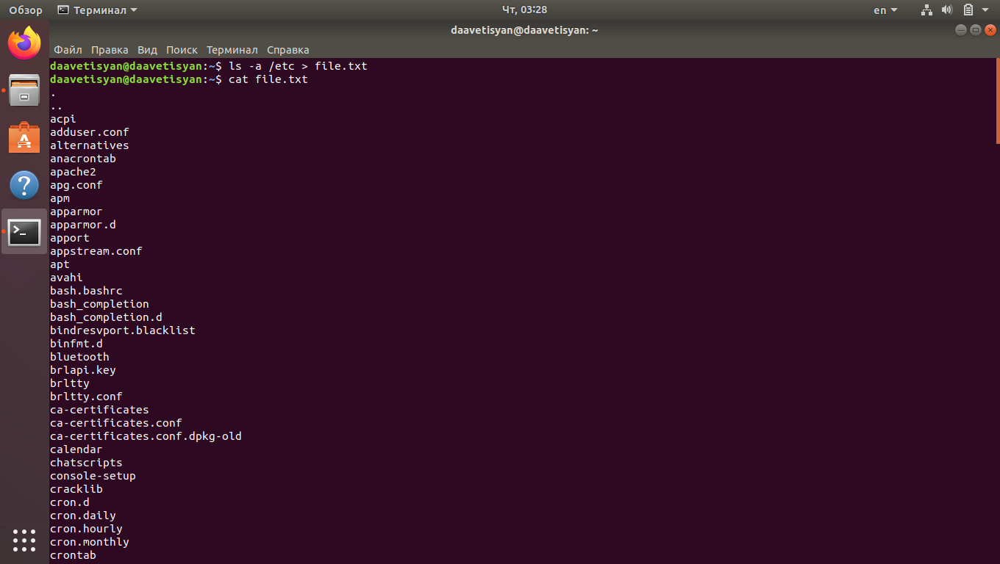
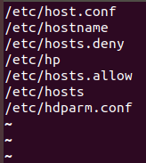
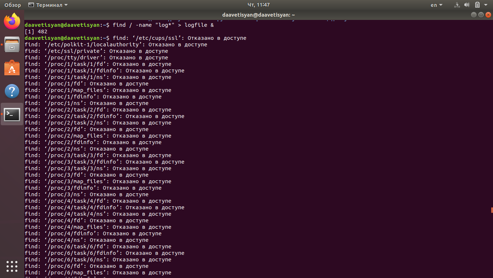
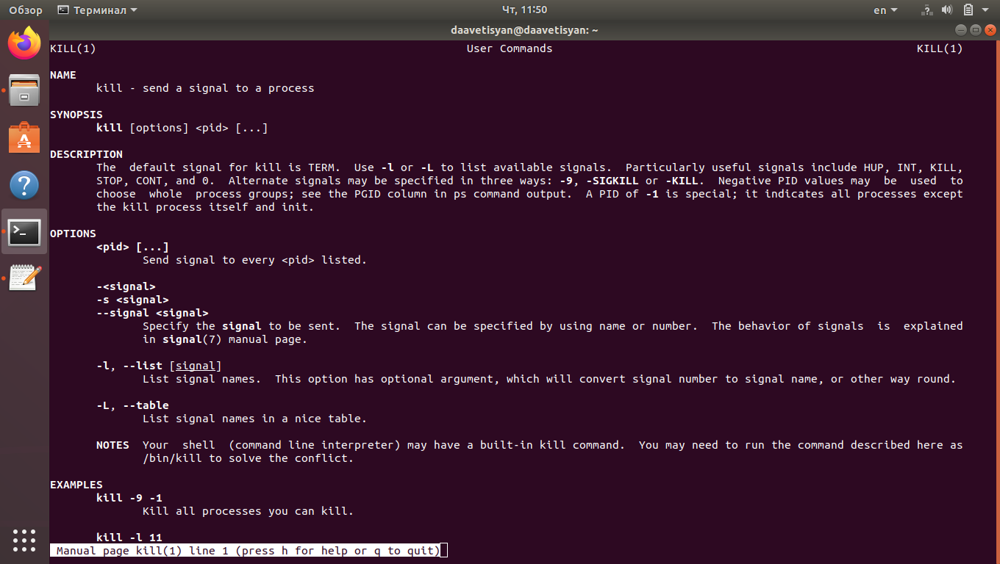
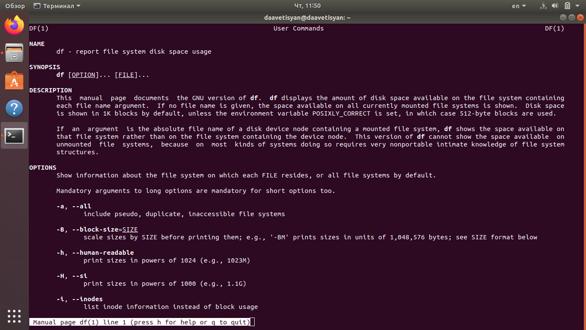
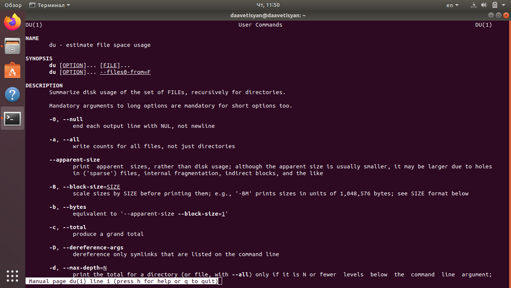
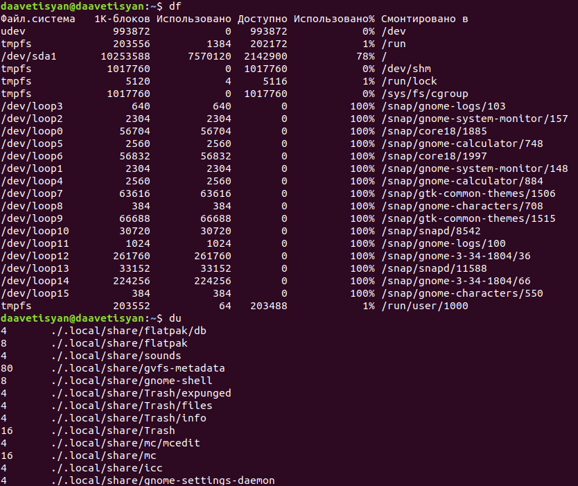
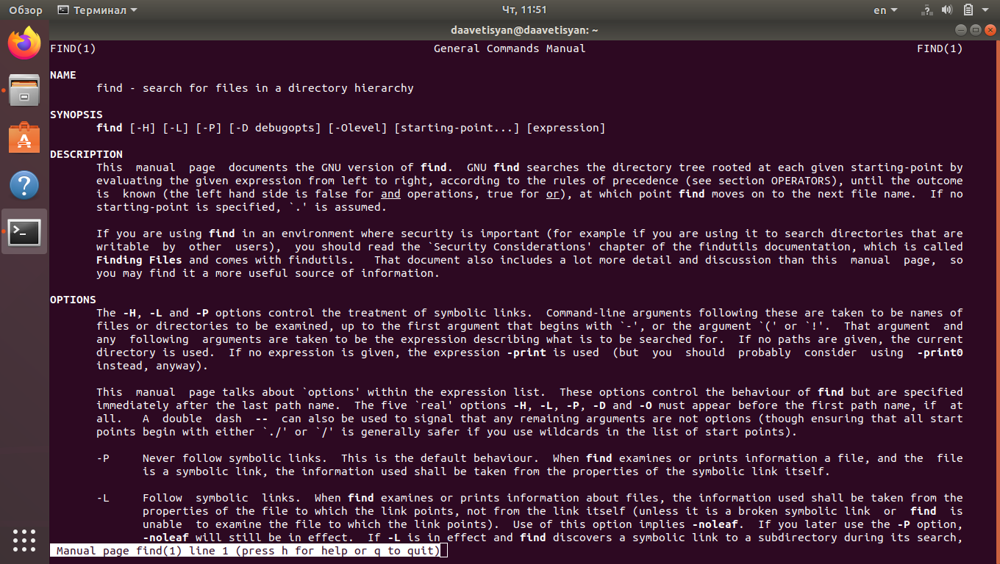
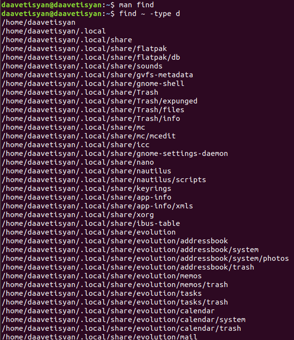

---
# Front matter
lang: ru-RU
title: "Отчёт по лабораторной работе №7"
subtitle: "Дисциплина: Операционные системы"
author: "Аветисян Давид Артурович"

# Formatting
toc-title: "Содержание"
toc: true # Table of contents
toc_depth: 2
lof: true # List of figures
lot: true # List of tables
fontsize: 12pt
linestretch: 1.5
papersize: a4paper
documentclass: scrreprt
polyglossia-lang: russian
polyglossia-otherlangs: english
mainfont: PT Serif
romanfont: PT Serif
sansfont: PT Sans
monofont: PT Mono
mainfontoptions: Ligatures=TeX
romanfontoptions: Ligatures=TeX
sansfontoptions: Ligatures=TeX,Scale=MatchLowercase
monofontoptions: Scale=MatchLowercase
indent: true
pdf-engine: lualatex
header-includes:
  - \linepenalty=10 # the penalty added to the badness of each line within a paragraph (no associated penalty node) Increasing the value makes tex try to have fewer lines in the paragraph.
  - \interlinepenalty=0 # value of the penalty (node) added after each line of a paragraph.
  - \hyphenpenalty=50 # the penalty for line breaking at an automatically inserted hyphen
  - \exhyphenpenalty=50 # the penalty for line breaking at an explicit hyphen
  - \binoppenalty=700 # the penalty for breaking a line at a binary operator
  - \relpenalty=500 # the penalty for breaking a line at a relation
  - \clubpenalty=150 # extra penalty for breaking after first line of a paragraph
  - \widowpenalty=150 # extra penalty for breaking before last line of a paragraph
  - \displaywidowpenalty=50 # extra penalty for breaking before last line before a display math
  - \brokenpenalty=100 # extra penalty for page breaking after a hyphenated line
  - \predisplaypenalty=10000 # penalty for breaking before a display
  - \postdisplaypenalty=0 # penalty for breaking after a display
  - \floatingpenalty = 20000 # penalty for splitting an insertion (can only be split footnote in standard LaTeX)
  - \raggedbottom # or \flushbottom
  - \usepackage{float} # keep figures where there are in the text
  - \floatplacement{figure}{H} # keep figures where there are in the text
---

# Цель работы

Ознакомление с инструментами поиска файлов и фильтрации текстовых данных. Приобретение практических навыков: по управлению процессами (и заданиями), по проверке использования диска и обслуживанию файловых систем.

# Задание

1. Осуществите вход в систему, используя соответствующее имя пользователя.
2. Запишите в файл file.txt названия файлов, содержащихся в каталоге /etc. Допишите в этот же файл названия файлов, содержащихся в вашем домашнем каталоге.
3. Выведите имена всех файлов из file.txt, имеющих расширение .conf, после чего запишите их в новый текстовой файл conf.txt.
4. Определите, какие файлы в вашем домашнем каталоге имеют имена, начинавшиеся с символа c? Предложите несколько вариантов, как это сделать.
5. Выведите на экран (постранично) имена файлов из каталога /etc , начинающиеся с символа h.
6. Запустите в фоновом режиме процесс, который будет записывать в файл ~/logfile файлы, имена которых начинаются с log.
7. Удалите файл ~/logfile.
8. Запустите из консоли в фоновом режиме редактор gedit.
9. Определите идентификатор процесса gedit, используя команду ps, конвейер и фильтр grep. Можно ли определить этот идентификатор более простым способом?
10. Прочтите справку (man) команды kill, после чего используйте её для завершения процесса gedit.
11. Выполните команды df и du, предварительно получив более подробную информацию об этих командах, с помощью команды man.
12. Воспользовавшись справкой команды find, выведите имена всех директорий, имеющихся в вашем домашнем каталоге.

# Выполнение лабораторной работы

1. Осуществляю вход в систему, используя свои логин и пароль.
2. Для того, чтобы записать в файл file.txt названия файлов, содержащихся в каталоге /etc, использую команду «ls –a /etc > file.txt» (рис. -@fig:001). Далее с помощью команды «ls -a ~ >> file.txt» дописываю в этот же файл названия файлов, содержащихся в моем домашнем каталоге (рис. -@fig:002). Командой «cat file.txt» просматриваю файл, чтобы убедиться в правильности действий (рис. -@fig:003).

{ #fig:001 }

{ #fig:002 }

{ #fig:003 }

3. Вывожу имена всех файлов из file.txt, имеющих расширение .conf и записываю их в новый текстовой файл conf.txt с помощью команды «grep -e ‘\.conf$’ file.txt > conf.txt». Командой «cat conf.txt» проверяю правильность выполненных действий (рис. -@fig:004).

{ #fig:004 }

4. Определить, какие файлы в моем домашнем каталоге имеют имена, начинающиеся с символа c, можно несколькими командами: «find ~ -maxdepth 1 -name “c*” -print» (опция maxdepth 1 необходима для того, чтобы файлы находились только в домашнем каталоге (не в его подкаталогах)), «ls ~/c*» и «ls –a ~ | grep c*» (рис. -@fig:005).

{ #fig:005 }

5. Чтобы вывести на экран (постранично) имена файлов из каталога /etc, начинающиеся с символа h, воспользуемся командой «find /etc –maxdepth 1 –name “h*” | less» (рис. -@fig:006).

{ #fig:006 }

6. Запускаю в фоновом режиме процесс, который будет записывать в файл ~/logfile файлы, имена которых начинаются с log, используя команду «find / -name “log*” > logfile &» (рис. -@fig:007). Командой «cat logfile» проверяю выполненные действия (рис. -@fig:008).
7. Удаляю файл ~/logfile командой «rm logfile».

{ #fig:007 }

{ #fig:008 }

8. Запускаю редактор gedit в фоновом режиме командой «gedit &» (рис. -@fig:009). После этого на экране появляется окно редактора.

{ #fig:009 }

9. Чтобы определить идентификатор процесса gedit, использую команду «ps | grep -i “gedit”». Наш процесс имеет PID 518. Узнать идентификатор процесса можно также, используя команду «pgrep gedit» или «pidof gedit» (рис. -@fig:010).

{ #fig:010 }

10. Прочитав информацию о команде kill с помощью команды «man kill», использую её для завершения процесса gedit (команда «kill 518») (рис. -@fig:011) (рис. -@fig:012).

{ #fig:011 }

{ #fig:012 }

11. C помощью команд «man df» (рис. -@fig:013) и «man du» (рис. -@fig:014) узнаю информацию по необходимым командам и далее использую их (рис. -@fig:015).  
df – утилита, показывающая список всех файловых систем по именам устройств, сообщает их размер, занятое и свободное пространство и точки монтирования.  
Синтаксис: df опции устройство  
du – утилита, предназначенная для вывода информации об объеме дискового пространства, занятого файлами и директориями. Она принимает путь к элементу файловой системы и выводит информацию о количестве байт дискового пространства или блоков диска, задействованных для его хранения.  
Синтаксис: du опции каталог_или_файл

{ #fig:013 }

{ #fig:014 }

{ #fig:015 }

12. Получаем информацию с помощью команды «man find» (рис. -@fig:016) и выводим имена всех директорий, имеющихся в домашнем каталоге с помощью команды «find ~ -type d» (рис. -@fig:017).

{ #fig:016 }

{ #fig:017 }

# Контрольные вопросы

1. В системе по умолчанию открыто три специальных потока: 
- stdin − стандартный поток ввода (по умолчанию: клавиатура), файловый дескриптор 0;
- stdout − стандартный поток вывода (по умолчанию: консоль), файловый дескриптор 1;
- stderr − стандартный поток вывод сообщений об ошибках (по умолчанию: консоль), файловый дескриптор 2. 
Большинство используемых в консоли команд и программ записывают результаты своей работы в стандартный поток вывода stdout.
2.   
">" Перенаправление вывода в файл  
">>" Перенаправление вывода в файл и открытие файла в режиме добавления (данные добавляются в конец файла).
3. Конвейер (pipe) служит для объединения простых команд или утилит в цепочки, в которых результат работы предыдущей команды передаётся последующей.  
Синтаксис следующий:  
команда 1 | команда 2 (это означает, что вывод команды 1 передастся на ввод команде 2)
4. Процесс рассматривается операционной системой как заявка на потребление всех видов ресурсов, кроме одного − процессорного времени.  
Этот последний важнейший ресурс распределяется операционной системой между другими единицами работы − потоками, которые и получили свое название благодаря тому, что они представляют собой последовательности (потоки выполнения) команд.  
Процесс − это выполнение программы. Он считается активной сущностью и реализует действия, указанные в программе.  
Программа представляет собой статический набор команд, а процесс - это набор ресурсов и данных, использующихся при выполнении программы.
5. pid: идентификатор процесса (PID) процесса (process ID), к которому вызывают метод  
gid: идентификатор группы UNIX, в котором работает программа.
6. Любую выполняющуюся в консоли команду или внешнюю программу можно запустить в фоновом режиме. Для этого следует в конце имени команды указать знак амперсанда &.  
Запущенные фоном программы называются задачами (jobs). Ими можно управлять с помощью команды jobs, которая выводит список запущенных в данный момент задач.
7. top − это консольная программа, которая показывает список работающих процессов в системе. Программа в реальном времени отсортирует запущенные процессы по их нагрузке на процессор.  
htop − это продвинутый консольный мониторинг процессов. Утилита выводит постоянно меняющийся список системных процессов, который сортируется в зависимости от нагрузки на ЦПУ. Если делать сравнение с top, то htop показывает абсолютно все процессы в системе, время их непрерывного использования, загрузку процессоров и расход оперативной памяти.
8. find − это команда для поиска файлов и каталогов на основе специальных условий. Ее можно использовать в различных обстоятельствах, например, для поиска файлов по разрешениям, владельцам, группам, типу, размеру и другим подобным критериям.  
Команда find имеет такой синтаксис:  
find папка параметры критерий шаблон действие  
Папка − каталог в котором будем искать.  
Параметры − дополнительные параметры, например, глубина поиска, и т.д.  
Критерий − по какому критерию будем искать: имя, дата создания, права, владелец и т.д.  
Шаблон – непосредственно значение по которому будем отбирать файлы.  
Основные параметры:
- -P никогда не открывать символические ссылки
- -L - получает информацию о файлах по символическим ссылкам. Важно для дальнейшей обработки, чтобы обрабатывалась не ссылка, а сам файл
- -maxdepth - максимальная глубина поиска по подкаталогам, для поиска только в текущем каталоге установите 1
- -depth - искать сначала в текущем каталоге, а потом в подкаталогах
- -mount искать файлы только в этой файловой системе
- -version - показать версию утилиты find
- -print - выводить полные имена файлов
- -type f - искать только файлы
- -type d - поиск папки в Linux  
Основные критерии:
- -name - поиск файлов по имени
- -perm - поиск файлов в Linux по режиму доступа
- -user - поиск файлов по владельцу
- -group - поиск по группе
- -mtime - поиск по времени модификации файла
- -atime - поиск файлов по дате последнего чтения
- -nogroup - поиск файлов, не принадлежащих ни одной группе
- -nouser - поиск файлов без владельцев
- -newer - найти файлы новее чем указанный
- -size - поиск файлов в Linux по их размеру  
Примеры:  
find ~ -type d поиск директорий в домашнем каталоге  
find ~ -type f -name ".*" поиск скрытых файлов в домашнем каталоге
9. Файл по его содержимому можно найти с помощью команды grep: «grep -r "слово/выражение, которое нужно найти"».
10. Утилита df, позволяет проанализировать свободное пространство на всех подключенных к системе разделах.
11. При выполнении команды du (без указания папки и опции) можно получить все файлы и папки текущей директории с их размерами. Для домашнего каталога: du ~/
12. Основные сигналы (каждый сигнал имеет свой номер), которые используются для завершения процесса:
- SIGINT – самый безобидный сигнал завершения, означает Interrupt. Он отправляется процессу, запущенному из терминала с помощью сочетания клавиш Ctrl+C. Процесс правильно завершает все свои действия и возвращает управление;
- SIGQUIT – это еще один сигнал, который отправляется с помощью сочетания клавиш, программе, запущенной в терминале. Он сообщает ей, что нужно завершиться и программа может выполнить корректное завершение или проигнорировать сигнал. В отличие от предыдущего, она генерирует дамп памяти. Сочетание клавиш Ctrl+/;
- SIGHUP – сообщает процессу, что соединение с управляющим терминалом разорвано, отправляется, в основном, системой при разрыве соединения с интернетом;
- SIGTERM – немедленно завершает процесс, но обрабатывается программой, поэтому позволяет ей завершить дочерние процессы и освободить все ресурсы;
- SIGKILL – тоже немедленно завершает процесс, но, в отличие от предыдущего варианта, он не передается самому процессу, а обрабатывается ядром. Поэтому ресурсы и дочерние процессы остаются запущенными.  
Также для передачи сигналов процессам в Linux используется утилита kill, её синтаксис: kill -сигнал pid_процесса (PID – уникальный
идентификатор процесса). Сигнал представляет собой один из выше перечисленных сигналов для завершения процесса.  
Перед тем, как выполнить остановку процесса, нужно определить его PID. Для этого используют команды ps и grep. Команда ps предназначена для вывода списка активных процессов в системе и информации о них. Команда grep запускается одновременно с ps (в канале) и будет
выполнять поиск по результатам команды ps.  
Утилита pkill – это оболочка для kill, она ведет себя точно так же, и имеет тот же синтаксис, только в качестве идентификатора процесса ей нужно передать его имя.  
killall работает аналогично двум предыдущим утилитам. Она тоже принимает имя процесса в качестве параметра и ищет его PID в директории /proc. Но эта утилита обнаружит все процессы с таким именем и завершит их.

# Выводы

В ходе выполнения данной лабораторной работы я изучил инструменты поиска файлов и фильтрации текстовых данных, а также
приобрёл практические навыки: по управлению процессами (и заданиями), по проверке использования диска и обслуживанию файловых систем.
